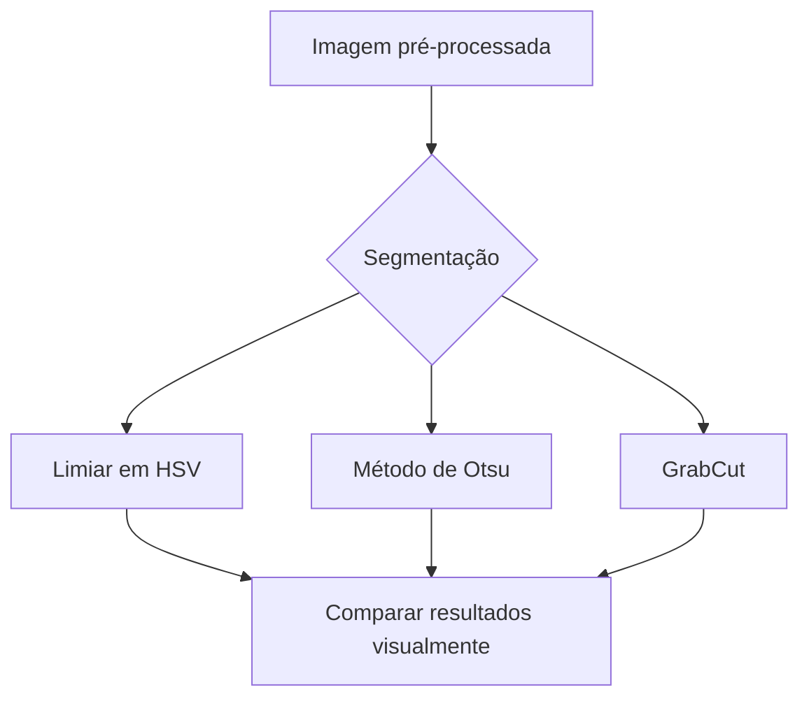
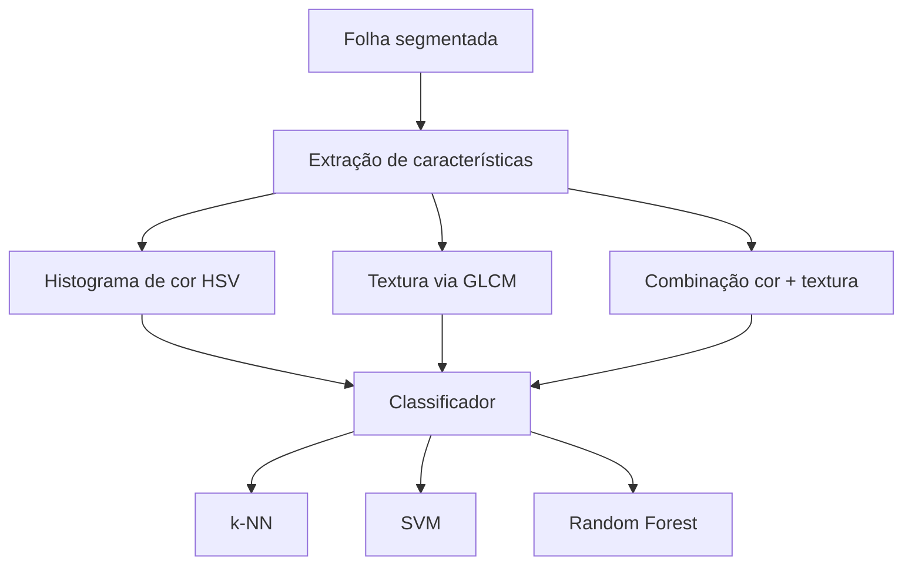
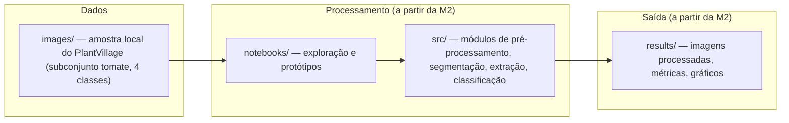

# Proposta Técnica — M1

## 1. Problema

O projeto investiga a **classificação de doenças foliares em plantas de tomate** a partir de fotografias digitais de folhas individuais, utilizando técnicas clássicas de Processamento Digital de Imagens — segmentação, extração de características de cor e textura, e classificação — sem depender de aprendizado profundo.

Evitamos deliberadamente uma formulação genérica como "usar IA para reconhecer doenças em plantas". Delimitamos:

- **Cultura:** apenas tomate (*Solanum lycopersicum*), não o dataset PlantVillage completo (14 culturas, 38 classes).
- **Classes:** 4, não as 10 disponíveis para tomate no dataset.
- **Entrada:** imagem de uma única folha, fotografada isoladamente contra um fundo relativamente uniforme (como no PlantVillage) — não uma foto de campo com múltiplas folhas e fundo variável.
- **Saída:** rótulo de uma entre 4 classes.

### Por que estas 4 classes

| Classe | Sintoma visual predominante |
|---|---|
| Saudável | Ausência de lesões; folha verde e uniforme |
| Requeima (*Late blight*) | Lesões grandes, irregulares, verde-acinzentadas a marrom-escuras, aspecto "encharcado" |
| Vira-cabeça-amarelo (*Tomato Yellow Leaf Curl Virus*) | Amarelecimento (clorose) e enrolamento das bordas da folha |
| Septoriose (*Septoria leaf spot*) | Muitas manchas pequenas e circulares, com centro claro/acinzentado e borda escura |

A escolha não foi aleatória: buscamos classes cujos sintomas, descritos na literatura fitopatológica, sugerem assinaturas de **cor e textura qualitativamente diferentes** entre si — em particular, o vira-cabeça-amarelo é o único sintoma que não é "manchas na folha", mas sim deformação + mudança de cor generalizada, o que deve torná-lo o mais fácil de separar das demais classes com características simples. Requeima, septoriose e (por contraste) a classe saudável cobrem, respectivamente, lesões grandes e difusas, lesões pequenas e numerosas, e ausência de lesão — três padrões de textura distintos.

Isso é uma **hipótese de projeto**, baseada em descrição textual dos sintomas, não em inspeção visual das imagens reais.

---

## 2. Contexto de aplicação

O diagnóstico de doenças foliares em tomate é hoje feito majoritariamente por inspeção visual — de agrônomos, quando disponíveis, ou do próprio produtor, o que exige experiência nem sempre presente em pequenas propriedades. Um classificador automático de baixo custo, operável a partir de uma foto simples, poderia funcionar como **ferramenta de triagem inicial**: sinalizar quando uma segunda opinião especializada é recomendada, sem substituir diagnóstico profissional.

Não pretendemos, na M1 (nem necessariamente na M3), entregar um produto pronto para uso em campo. O contexto serve para justificar decisões técnicas: por exemplo, assumir imagens de folha isolada e fundo controlado (como no PlantVillage) é uma simplificação razoável para um projeto de disciplina, mas distante do cenário de uso real — o que registramos como limitação explícita na Seção 9, não como algo que pretendemos resolver silenciosamente.

---

## 3. Objetivo

**Objetivo geral:** desenvolver um pipeline de PDI capaz de classificar automaticamente uma imagem de folha de tomate em uma das quatro classes definidas (saudável, requeima, vira-cabeça-amarelo, septoriose), a partir de características de cor e textura extraídas da região foliar segmentada.

**Objetivos específicos:**

1. Segmentar a folha do fundo da imagem.
2. Extrair um conjunto de características de cor (ex.: histogramas em espaço HSV) e de textura (ex.: matriz de coocorrência de níveis de cinza — GLCM) da região foliar segmentada.
3. Avaliar comparativamente pelo menos dois classificadores clássicos (ex.: k-NN e SVM) sobre essas características.
4. Definir e aplicar métricas objetivas de sucesso (Seção 4) para avaliar formalmente os resultados na M2/M3.

O objetivo descreve o que o sistema deve **fazer com as imagens** — não apenas as tecnologias envolvidas.

---

## 4. Entrada, saída e critérios de sucesso

- **Entrada:** imagem digital (RGB) de uma folha de tomate, fotografada individualmente contra um fundo homogêneo, como nas imagens do PlantVillage.
- **Saída:** rótulo de classe entre as 4 definidas (opcionalmente, quando o classificador permitir, acompanhado de uma medida de confiança).

**Critérios de sucesso verificáveis** (a serem checados na M2/M3, não nesta etapa):

- O sistema deve distinguir as 4 classes com desempenho sensivelmente melhor que o acaso (baseline ingênuo de 25% de acurácia para 4 classes balanceadas).
- Ao final da M2, esperamos ter uma versão do pipeline completo rodando de ponta a ponta sobre um subconjunto do dataset — mesmo com desempenho modesto — com métricas registradas (acurácia por classe, matriz de confusão).
- A matriz de confusão deve ser analisada para verificar quais classes são mais confundidas entre si; temos como hipótese inicial que requeima e septoriose (ambas com lesões escuras) são mais propensas a confusão do que qualquer uma delas com o vira-cabeça-amarelo.

```text
imagem
   ↓
pré-processamento
   ↓
segmentação folha/fundo
   ↓
extração de características (cor + textura)
   ↓
classificação
   ↓
classe prevista
```

## 5. Imagens e dados

Detalhes completos (origem, licença, contagens, instruções de acesso) em [`../images/README.md`](../images/README.md). Resumo:

- Dataset: **PlantVillage** (Hughes & Salathé, 2015) [1], subconjunto de tomate.
- Aproximadamente 54 mil imagens no dataset completo (38 classes, 14 culturas); o subconjunto de tomate tem 10 classes, com contagem de imagens que varia (~14 a 18 mil) conforme o espelho/versão consultado.
- Licença original: CC0 (domínio público) — **(https://data.mendeley.com/datasets/tywbtsjrjv/1)**
- Nenhuma característica das imagens reais (cores predominantes, resolução, presença de ruído, etc.) foi verificada até o momento — ver Seção 8.2.

---

## 6. Pipeline preliminar


Para cada etapa, finalidade, técnicas cogitadas e dúvidas em aberto:

| Etapa | Finalidade | Técnica(s) inicialmente consideradas | Entrada | Saída | Principais dúvidas em aberto |
|---|---|---|---|---|---|
| Pré-processamento | Padronizar imagens antes das etapas seguintes | Redimensionamento; correção de iluminação (ex.: CLAHE); redução de ruído (filtro Gaussiano) | Imagem RGB original | Imagem RGB padronizada | Quanto essa padronização realmente ajuda, já que o PlantVillage tem fundo/iluminação controlados — precisa ser testado |
| Segmentação folha/fundo | Isolar a folha para que características extraídas a seguir não sejam afetadas pelo fundo | Limiarização em HSV (fundo costuma ser claro/homogêneo); método de Otsu; GrabCut (OpenCV) como alternativa mais robusta | Imagem padronizada | Máscara binária + folha segmentada | Qual método generaliza melhor entre as 4 classes — nenhum foi testado ainda |
| Extração de características | Resumir a folha segmentada em um vetor numérico que capture cor e textura das lesões | Histograma de cor em HSV; GLCM (contraste, homogeneidade, energia) para textura; possível combinação dos dois | Folha segmentada | Vetor de características | Quais descritores realmente discriminam as 4 classes escolhidas — é o cerne da investigação de viabilidade (Seção 8) |
| Classificação | Atribuir uma das 4 classes ao vetor de características | k-NN (baseline simples); SVM; Random Forest | Vetor de características | Classe prevista (+ confiança, se aplicável) | Qual classificador funciona melhor com poucos dados; quantas imagens por classe bastam para um baseline razoável |

### Alternativas consideradas em cada etapa crítica





Na M1, foram realizados experimentos preliminares com histograma de cor em HSV e segmentação por limiarização em HSV. As demais alternativas, como Otsu e GrabCut, permanecem como possibilidades para comparação nas próximas etapas.

---

## 7. Arquitetura preliminar



`src/`, `notebooks/`, `tests/` e `results/` ainda não existem neste repositório — serão criados quando houver conteúdo real para colocar neles, a partir da M2.A arquitetura é compatível com o estágio atual: planejamento de organização, não implementação.

---

## 8. Estudo inicial de viabilidade

### 8.1 Razões preliminares para acreditar que o projeto é viável

Razões baseadas em pesquisa e raciocínio técnico, obtidas **antes de qualquer manipulação real das imagens**:

- O PlantVillage é um dos datasets mais utilizados na literatura acadêmica de classificação de doenças de plantas; múltiplos trabalhos publicados obtiveram bons resultados com ele [1, 2], o que é evidência indireta de que o problema é solucionável com as imagens disponíveis.
- O dataset é gratuito, já rotulado por classe, e grande o suficiente mesmo restringindo o escopo a 4 classes de uma única cultura.
- Segundo a descrição textual dos sintomas (Seção 1), as 4 classes escolhidas têm assinaturas visuais qualitativamente distintas — em especial, o vira-cabeça-amarelo (amarelecimento + deformação) deveria ser separável das demais com características simples de cor.
- As técnicas cogitadas (limiarização, GLCM, k-NN/SVM) são clássicas, bem documentadas e não exigem hardware especializado (GPU), compatível com o prazo e os recursos da disciplina.

### 8.2 Investigação inicial

A investigação foi iniciada com o download e a inspeção visual das imagens das quatro classes escolhidas. Foram observadas aproximadamente 15–20 imagens de cada classe, buscando identificar diferenças visíveis antes dos testes quantitativos.

- [X] Baixar o subconjunto de tomate do PlantVillage (ver `images/README.md`)
- [X] Inspecionar manualmente pelo menos 15–20 imagens de cada uma das 4 classes e registrar, com as próprias palavras do grupo, semelhanças e diferenças visuais observadas
- [X] Verificar, com um histograma de cor simples (ex.: em HSV), se existe alguma separação visível entre pelo menos duas das classes
- [ ] Testar pelo menos um método de segmentação folha/fundo em um pequeno lote de imagens e avaliar visualmente o resultado
- [ ] Atualizar esta seção com os resultados dos testes, incluindo imagens de exemplo quando possível

#### Inspeção visual das imagens

#### Tomato___healthy
- As folhas são, em geral, verdes.
- Não foram percebidas manchas grandes ou alterações muito evidentes.
- O fundo das imagens é relativamente uniforme.

#### Tomato___Late_blight
- Foram observadas manchas mais escuras em várias das folhas.
- As manchas variam de tamanho e formato entre as imagens.
- As folhas apresentam mais variação de cor do que as da classe saudável.

#### Tomato___Septoria_leaf_spot
- Foram observadas várias manchas pequenas espalhadas pelas folhas.
- As manchas apresentam uma diferença de cor em relação ao restante da folha.
- A quantidade e a distribuição das manchas mudam entre as imagens.

#### Tomato___Tomato_Yellow_Leaf_Curl_Virus
- Foram observadas folhas com partes mais amareladas.
- Algumas imagens apresentam folhas com aparência diferente no formato, como bordas enroladas.
- A mudança de cor parece ser mais geral na folha, em vez de estar concentrada apenas em pequenas manchas.

#### Observação inicial

Pela observação das imagens, foi possível perceber algumas diferenças entre as quatro classes, principalmente nas cores e na presença ou distribuição de manchas. Porém, ainda não sabemos se essas diferenças serão suficientes para separar as classes automaticamente. Por isso, serão realizados testes com os dados, começando pelo histograma de cor.

#### Histograma de cor HSV

Foi realizado um primeiro teste utilizando a distribuição do canal H (matiz) do espaço HSV nas quatro classes. O histograma apresentou diferenças na distribuição de matiz entre as classes. A classe `Tomato___Tomato_Yellow_Leaf_Curl_Virus` apresentou uma concentração diferente das demais, principalmente em uma faixa de matizes associada a tons mais amarelados. Por outro lado, `Tomato___healthy` e `Tomato___Septoria_leaf_spot` apresentaram maior sobreposição.

Esse resultado indica que o canal H pode ser útil como uma característica de cor, mas provavelmente não será suficiente sozinho para separar todas as quatro classes. Por isso, a investigação continuará considerando outras características de cor e, posteriormente, características de textura.


## 9. Limitações e riscos conhecidos

- As imagens do PlantVillage são capturadas em fundo controlado; um sistema em campo real enfrentaria fundo variável, múltiplas folhas e iluminação não controlada — fora do escopo desta etapa, mas relevante para contextualizar o que a M3 poderá (ou não) alcançar.
- Restringir a 4 classes simplifica o problema, mas significa que o sistema não cobre as demais 6 doenças de tomate presentes no PlantVillage nem outras culturas — trade-off consciente entre escopo tratável e generalidade.
- Classes com lesões visualmente parecidas (requeima e septoriose, por exemplo) podem ser confundidas por características simples de cor/textura — risco identificado a partir da leitura da literatura sobre os sintomas, ainda não confirmado empiricamente neste projeto.

---

## 10. Uso de Inteligência Artificial generativa

Ver [`../AI_USAGE.md`](../AI_USAGE.md) para o registro completo, conforme exigido na Seção 16 do enunciado.

---

## 11. Referências

[1] HUGHES, D. P.; SALATHÉ, M. *An open access repository of images on plant health to enable the development of mobile disease diagnostics through machine learning and crowdsourcing.* arXiv:1511.08060, 2015.

[2] MOHANTY, S. P.; HUGHES, D. P.; SALATHÉ, M. *Using Deep Learning for Image-Based Plant Disease Detection.* Frontiers in Plant Science, v. 7, art. 1419, 2016.

[3] GONZALEZ, R. C.; WOODS, R. E. *Digital Image Processing.* 4. ed. Nova York: Pearson, 2018. — referência geral para as técnicas de PDI mencionadas (segmentação, histogramas, GLCM).

Esta é uma lista **inicial**, ponto de partida para leitura própria do grupo — não uma revisão de literatura já realizada. Deve ser expandida conforme o grupo efetivamente ler e utilizar outras fontes.

---

